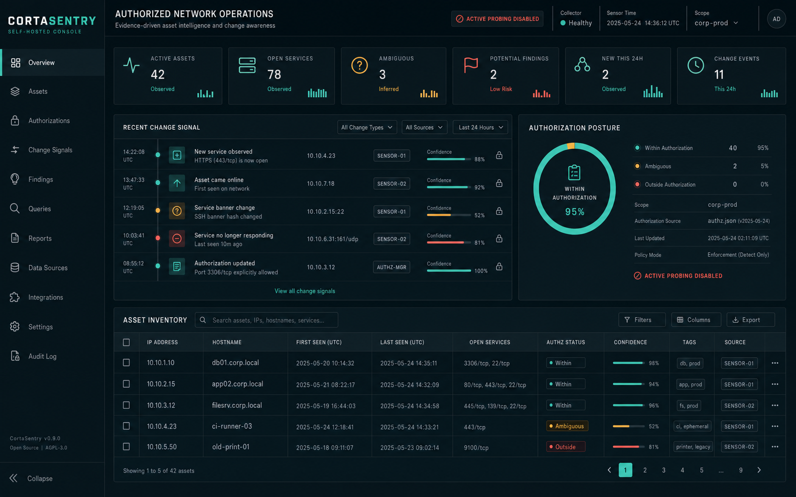

# CortaSentry

CortaSentry is a self-hosted defensive network asset intelligence system for networks and devices you own, administer, or are explicitly authorized to assess. It preserves observations as immutable evidence, resolves them into conservative asset identities, applies deterministic and explainable fingerprint rules, records changes, and keeps an audit trail of sensitive actions.



_ImageGen design reference used to guide the implemented console; the live UI renders only API-backed data._

It is not an exploitation framework, credential tester, internet scanner, packet sniffer, or proof that a vulnerability is exploitable. Active probes are disabled by default and every target and port must pass the same allowlist policy immediately before a connection.

## Install

Linux and macOS builders need Go 1.25+ and Node.js 20+:

```sh
git clone https://github.com/cortalabs/cortasentry.git
cd cortasentry
./install.sh
mkdir -p ~/cortasentry && cd ~/cortasentry
cortasentry init
```

The installer builds as your normal user and asks for administrator permission only for the final copy into `/usr/local`. Use `./install.sh --prefix "$HOME/.local"` for an entirely unprivileged install. It uses locked frontend dependencies, runs frontend and backend tests, builds static binaries, and installs the example rules and MCP harness configurations. It does not initialize secrets or enable scanning.

## Five-minute loopback demo

```sh
cortasentry init
cortasentry demo
cortasentry serve
```

Open <http://127.0.0.1:8088> and inspect Assets, Observations, Rules, Changes, Jobs, Findings, and Audit. The login screen can read `data/admin.token` directly with the browser file picker, and an existing browser session is restored automatically. If the token file is lost, run `cortasentry token rotate`; the replacement is written with mode `0600` and prior tokens and sessions are revoked. The demo starts loopback-only fixtures, scans two deterministic states, persists evidence, updates the same fixture assets, and produces a title-change event. It never probes the LAN.

From a source checkout, `make demo` runs the automated smoke test in a temporary directory.

## Authorized scans

Normal installations perform no active probing. Edit `cortasentry.yaml` deliberately:

```yaml
scope:
  active_enabled: true
  allowed_cidrs: [192.168.50.0/24]
  denied_cidrs: [192.168.50.1/32]
  allow_public_targets: false
  allowed_ports: [22, 80, 443]
  max_hosts_per_job: 256
  max_ports_per_host: 64
```

Then validate and scan only authorized space:

```sh
cortasentry config validate
cortasentry scan --cidr 192.168.50.0/24 --ports 22,80,443
```

CIDRs are expanded under the host budget, normalized with `net/netip`, and checked again per connection. Hostnames are intentionally unsupported in v0.1 to remove DNS rebinding ambiguity.

## CLI

```text
cortasentry init
cortasentry serve
cortasentry demo
cortasentry scan --cidr ... --ports ... [--json]
cortasentry assets list
cortasentry observations list
cortasentry rules validate
cortasentry rules test
cortasentry import nmap|zeek|suricata|nuclei PATH [--dry-run]
cortasentry token rotate
cortasentry config validate
cortasentry version
```

Set `CORTASENTRY_CONFIG`, `CORTASENTRY_BIND`, or `CORTASENTRY_DATABASE` for common deployment overrides.

## Docker

```sh
docker compose build
docker compose run --rm cortasentry init
docker compose up -d
```

The image runs as a non-root user and stores state in `/data`. Configure reverse-proxy TLS before any non-loopback deployment; see [operations](docs/OPERATIONS.md).

## Architecture and security

CortaSentry is a Go modular monolith with SQLite WAL storage and an embedded React/Vite console. Collection, observation ingestion, identity resolution, fingerprint evaluation, findings, change detection, jobs, audit, API, and UI have explicit internal boundaries. There is no cloud service, phone-home telemetry, LLM, Council dependency, external queue, or CGO requirement.

Read [architecture](docs/ARCHITECTURE.md), [threat model](docs/THREAT_MODEL.md), [fingerprint rules](docs/FINGERPRINT_RULES.md), [operations](docs/OPERATIONS.md), and the [security review](docs/SECURITY_REVIEW.md).

For interoperability and passive node visibility, see the [integration surfaces](docs/INTEGRATIONS.md), [versioned observation contract](docs/OBSERVATION_CONTRACT.md), and [local connection monitoring](docs/CONNECTION_MONITORING.md). Export JSONL with `cortasentry observations export`; take an explicit Linux socket snapshot with `cortasentry connections snapshot`.

## Agent access through MCP

CortaSentry ships an official-SDK MCP stdio server for Codex and Claude Code:

```sh
CORTASENTRY_CONFIG=/absolute/path/cortasentry.yaml ./scripts/install-mcp.sh
```

Read tools are available by default. MCP writes and active scan creation require separate explicit configuration gates and still use the normal scope engine. See [MCP integration](docs/MCP.md) for the full tool list and manual harness configuration.

## Current limitations

Version 0.1 establishes a working defensive vertical slice, not complete production readiness. Live remote sensors, PostgreSQL, authenticated SNMP/SSH identity collection, Nmap execution, advisory feed updates, cryptographic rule signing, fully calibrated identification scores, and high-availability deployment are not implemented. mDNS/SSDP are finite local collectors but not yet scheduled by the scan job. New-service, certificate, classification, and HTTP-title deltas are recorded; service removal and asset disappearance still require configurable multi-scan grace reconciliation. Imported Nuclei results remain unverified observations and never become safely validated findings automatically.

## Development

```sh
make bootstrap
make lint
make test
make test-race
make build
make smoke
```

See [CONTRIBUTING.md](CONTRIBUTING.md). Licensed under the [MIT License](LICENSE).
